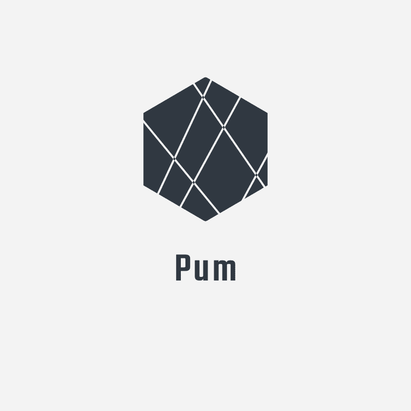

<!-- PROJECT SHIELDS -->
<!--
*** I'm using markdown "reference style" links for readability.
*** Reference links are enclosed in brackets [ ] instead of parentheses ( ).
*** See the bottom of this document for the declaration of the reference variables
*** for contributors-url, forks-url, etc. This is an optional, concise syntax you may use.
*** https://www.markdownguide.org/basic-syntax/#reference-style-links
-->

[![Contributors][contributors-shield]][contributors-url]
[![Forks][forks-shield]][forks-url]
[![Stargazers][stars-shield]][stars-url]
[![Issues][issues-shield]][issues-url]
[![MIT License][license-shield]][license-url]

<!-- PROJECT LOGO -->
<br />
<div align="center">
  <a href="https://github.com/PumPum7/svelte-portfolio">
    
  </a>

<h3 align="center">Portfolio Page</h3>

  <p align="center">
    A portfolio built on top of Svelte Kit
    <br />
    <a href="https://github.com/PumPum7/svelte-portfolio">View Demo</a>
    ·
    <a href="https://github.com/PumPum7/svelte-portfolio/issues">Report Bug</a>
    ·
    <a href="https://github.com/PumPum7/svelte-portfolio/issues">Request Feature</a>
  </p>
</div>

<!-- TABLE OF CONTENTS -->
<details>
  <summary>Table of Contents</summary>
  <ol>
    <li>
      <a href="#about-the-project">About The Project</a>
      <ul>
        <li><a href="#built-with">Built With</a></li>
      </ul>
    </li>
    <li>
      <a href="#getting-started">Getting Started</a>
      <ul>
        <li><a href="#prerequisites">Prerequisites</a></li>
        <li><a href="#installation">Installation</a></li>
      </ul>
    </li>
    <li><a href="#usage">Usage</a></li>
    <li><a href="#roadmap">Roadmap</a></li>
    <li><a href="#contributing">Contributing</a></li>
    <li><a href="#license">License</a></li>
    <li><a href="#contact">Contact</a></li>
    <li><a href="#acknowledgments">Acknowledgments</a></li>
  </ol>
</details>

<!-- ABOUT THE PROJECT -->

## About The Project

[![Product Name Screen Shot][product-screenshot]](https://repository-images.githubusercontent.com/581631360/7477b723-39c1-4dae-ad81-c0b1c14be808)

This developer portfolio project was built using Svelte Kit, SCSS, and TypeScript. It serves as a platform to showcase
my work and skills to potential employers or clients, and includes a list of my past projects with descriptions and live
demos/code repositories. The website also includes a section highlighting my skills and experience, as well as a contact
feature for easy communication. The goal of this project is to give an understanding of my capabilities and personality
as a developer, and to provide a way for potential employers or clients to reach out to me.

<p align="right">(<a href="#readme-top">back to top</a>)</p>

### Built With

- [![Svelte][svelte.dev]][svelte-url]
- [![Typescript][typescriptlang.org]][typescript-url]
- [![SCSS][sass-lang.com]][sass-url]

<p align="right">(<a href="#readme-top">back to top</a>)</p>

<!-- GETTING STARTED -->

## Getting Started

### Prerequisites

To setup and run this project locally, you will need to have NodeJS and NPM installed.
It is also recommended to use Yarn for package management.

- npm
  ```sh
  npm install npm@latest -g
  ```

- Yarn
    ```sh
    corepack prepare yarn@stable --activate
    ```

### Installation

1. In the project folder, run yarn or npm install to install all necessary packages.
2. Create a Discord Webhook URL and add it to the .env file.
3. Start the website in development mode by running yarn run dev or npm run dev.

<p align="right">(<a href="#readme-top">back to top</a>)</p>

<!-- USAGE EXAMPLES -->

## Hosting

It is recommended to host this portfolio using [Vercel](https://vercel.com) and the default
Svelte Kit configuration. If you prefer to use a different hosting
platform, you will need to modify the adapter in the svelte.config.js
file. Consult the [documentation](https://kit.svelte.dev/docs/adapters) for more information on how to do this.

<p align="right">(<a href="#readme-top">back to top</a>)</p>

<!-- ROADMAP -->

## Roadmap

- [x] Contact Feature
- [ ] i18 inclusion for German
- [ ] Analytics
- [ ] Improved projects section
    - [ ] Add proper previews for every project
    - [ ] Include all used technologies
    - [ ] Allow filtering
    - [ ] Own Page for all projects and only showcase specific projects on the main side
- [ ] Make the design more personal and unique

See the [open issues](https://github.com/PumPum7/svelte-portfolio/issues) for a full list of proposed features (and
known issues).

<p align="right">(<a href="#readme-top">back to top</a>)</p>

<!-- CONTRIBUTING -->

## Contributing

Contributions are what make the open source community such an amazing place to learn, inspire, and create. Any
contributions you make are **greatly appreciated**.

If you have a suggestion that would make this better, please fork the repo and create a pull request. You can also
simply open an issue with the tag "enhancement".
Don't forget to give the project a star! Thanks again!

1. Fork the Project
2. Create your Feature Branch (`git checkout -b feature/AmazingFeature`)
3. Commit your Changes (`git commit -m 'Add some AmazingFeature'`)
4. Push to the Branch (`git push origin feature/AmazingFeature`)
5. Open a Pull Request

<p align="right">(<a href="#readme-top">back to top</a>)</p>

<!-- LICENSE -->

## License

Distributed under the MIT License. See `LICENSE.txt` for more information.

<p align="right">(<a href="#readme-top">back to top</a>)</p>

<!-- CONTACT -->

## Contact

Michael - [@Officer_Pum](https://twitter.com/Officer_Pum)

Project Link: [https://github.com/PumPum7/svelte-portfolio](https://github.com/PumPum7/svelte-portfolio)

<!-- MARKDOWN LINKS & IMAGES -->
<!-- https://www.markdownguide.org/basic-syntax/#reference-style-links -->

[contributors-shield]: https://img.shields.io/github/contributors/PumPum7/svelte-portfolio.svg?style=for-the-badge

[contributors-url]: https://github.com/PumPum7/svelte-portfolio/graphs/contributors

[forks-shield]: https://img.shields.io/github/forks/PumPum7/svelte-portfolio.svg?style=for-the-badge

[forks-url]: https://github.com/PumPum7/svelte-portfolio/network/members

[stars-shield]: https://img.shields.io/github/stars/PumPum7/svelte-portfolio.svg?style=for-the-badge

[stars-url]: https://github.com/PumPum7/svelte-portfolio/stargazers

[issues-shield]: https://img.shields.io/github/issues/PumPum7/svelte-portfolio.svg?style=for-the-badge

[issues-url]: https://github.com/PumPum7/svelte-portfolio/issues

[license-shield]: https://img.shields.io/github/license/PumPum7/svelte-portfolio.svg?style=for-the-badge

[license-url]: https://github.com/PumPum7/svelte-portfolio/blob/master/LICENSE.txt

[product-screenshot]: images/screenshot.png

[svelte.dev]: https://img.shields.io/badge/Svelte-4A4A55?style=for-the-badge&logo=svelte&logoColor=FF3E00

[svelte-url]: https://svelte.dev/

[typescriptlang.org]: https://img.shields.io/badge/Typescript-4A4A55?style=for-the-badge&logo=typescript&logoColor=3077c5

[typescript-url]: https://www.typescriptlang.org/

[sass-lang.com]: https://img.shields.io/badge/SCSS-4A4A55?style=for-the-badge&logo=sass&logoColor=cc6699

[sass-url]: https://sass-lang.com/
